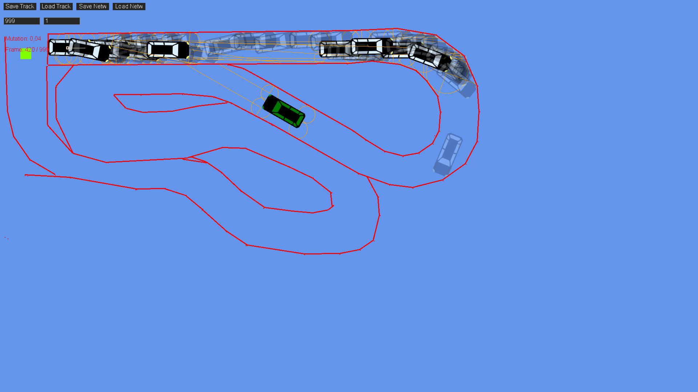

# Car_AI

__Project creation date:__ 04.12.2019

## Description
This project was developed by Marvin Ott and Alexander Schönhofer during the last year of the HTL.\
It simulates cars trying to navigate a track with neural networks.\
Included is a track editor and saving/loading of tracks & neural networks.

## Technologies
* C#
* MonoGame

## Remarks
The AI is not that great at learning

## Pictures

